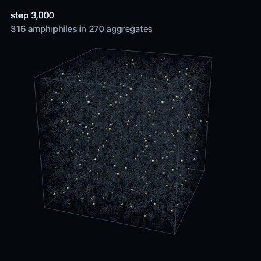

# protocell-genesis

[](https://github.com/nefayran/protocell-genesis/actions/workflows/ci.yml)
[](LICENSE)


Can a coarse-grained "primordial soup" of monomers assemble itself into a closed vesicle, a bilayer
membrane with water trapped inside? This project built a WebGPU simulation to find out, fixed the pass
criteria before running it, and got a negative answer with a measured cause.

[Snapshot gallery](https://nefayran.github.io/protocell-genesis/viewer/gallery.html) (WebGL, any
current browser) · [Live simulation](https://nefayran.github.io/protocell-genesis/viewer/run.html)
(WebGPU) · [Gate report](https://nefayran.github.io/protocell-genesis/verify/out/report.html) ·
[Full verdict](docs/verdict.md)

## Result

No closed vesicle formed in any snapshot of any campaign.

The largest campaign ran a 76 σ box with 483,268 particles, liquid water at density 0.80, charge at pH
7.0 and ionic strength 0.01 M, for 148,200 steps, starting from a lattice of monomers. It grew one
aggregate holding 99.93% of the amphiphiles. That aggregate percolated through the periodic box along
all three axes in 23 of 23 wet snapshots, and it trapped no water at all.



Four explanations were tested and ruled out by measurement:

| explanation | test | outcome |
|---|---|---|
| too much material merges into one object | supply lowered to 1.50× the closure threshold, then raised to 4.82× | 3 of 3 wrapping axes both times |
| a finite object pays too much for its edge | edge energy measured at 0.583 kT per molecule (N = 2,087) | below the ≲ 1 kT that would matter |
| head groups repel too weakly | the pair-energy gap narrowed from 2.86× to 1.26× | wrapping axes moved by 0 |
| the box is too small | box volume ×2.79 at constant density (54 σ to 76 σ) | 3 of 3 axes, 27 of 27 layers, in all 23 snapshots |

A later run put the soup in a finite parcel of water with a neutral wall, which removes the periodic
topology. The aggregate stopped wrapping (0 of 3 axes, the first time that gate passed), and closure
still did not happen: encapsulated water was exactly 0 in 19 of 19 snapshots. The periodic boundary was
a consequence, not the cause.

What is left is the molecule. In a finite region the cheapest object without an edge is a capped
micelle of about 19 amphiphiles, while a closed vesicle needs at least about 990. The last task gave the
heads a measured acid–soap pair (computed with the atomic engine below); across the pair strengths that
keep the bilayer intact, closure still costs 52.5 to 53.2 times more than that micelle.

What did agree with the literature:

- bilayer area per lipid in explicit water, 1.1734 σ² (corridor 1.1 to 1.5), and thickness, 4.4689 σ
  (corridor 4 to 6);
- the one independent check in the project: the salt-induced shift of the apparent pKa, +0.709 against
  about 0.7.

The bending modulus stayed unproven because its fit window was invalid.

## Rules the project held itself to

- Every gate is a claim with a model value, a literature corridor, a verdict and an evidence rank: A
  measured, B computed, C bounded by thermodynamics or an independent ratio, D estimated. A gate that
  rests only on D evidence is unproven by definition. Gates are published as passed, failed or
  unproven, and they are never widened to pass.
- `engine/` contains no hand-written chemical constants; it reads them from `data/`.
- Hydrophobicity has to emerge from water displacement, never from a direct attraction between tails.
- The bond attempt rate is not tuned to get a result.

## What is in the repository

| layer | what it does | where |
|---|---|---|
| soup | bond chemistry on the GPU: C–C chain growth on a catalyst, head termination, valence, dehydration and rehydration, solvent evaporation, a clay plate | `soup/` |
| explicit water | water as its own bead type, with attraction by class (solvent, polar, apolar) and depth ratios taken from Martini v2.1 | `soup/wgsl/step.wgsl`, `data/soup.json` |
| electrostatics | screened Coulomb (Debye–Hückel) between heads; charge is a Monte Carlo variable at constant pH | `soup/src/electrostatics.ts` |
| measurement | amphiphile detection, aggregate decomposition, shape from the inertia tensor, head layers, cavity, encapsulated water, box wrapping | `soup/src/aggregates.ts`, `soup/src/water-closure.ts` |
| gates | definitions in `data/literature.json`, verdict rules in `verify/gates.ts`, one run of all of them in `verify/run.ts` | `verify/` |
| live viewer | a run page with start, pause and stop, live measurements, the aggregate breakdown and a cavity highlight | `viewer/run.html` |
| gallery | the campaign checkpoints rendered with WebGL, and the exporter that decodes them | `viewer/gallery.html`, `soup/cli/export-gallery.ts` |
| long runs | a campaign CLI with checkpoints and resume | `soup/cli/campaign.ts` |
| atomic engine | Python molecular dynamics where no reaction is listed: bonds come from electronic-structure bond orders and a reaction is a change in connectivity. GFN2-xTB (tblite) drives trajectories, Hartree–Fock and DFT (pyscf) give reference energies | `atomic/` |

The atomic detail shown in the live viewer is a reconstruction on top of coarse-grained coordinates,
not all-atom dynamics, and the page says so.

### A learned interatomic potential

`atomic/train/` distils a fast potential from a slower teacher (MACE-OFF23 in the final runs). Against
experiment it gets the O–H bond length of water slightly closer than its teacher does (0.9585 Å and
0.9589 Å against 0.9572 Å), the H–O–H angle slightly further (105.05° and 104.96° against 104.52°), and
it underestimates the hydrogen-bond energy by 14%. Force error is 65 meV/Å on frames from dynamics and
109 meV/Å on random frames. It runs 11 to 31 times faster than the teacher. The trained weights are not
included: they were fitted to MACE-OFF23 labels, and the licence terms of those models differ from this
repository's.

## Six silent failures

Each of these looked like a success. Three are specific to WebGPU, and all six are worth knowing before
you trust a GPU simulation:

1. `readBack` from a buffer without `COPY_SRC` returns the zero-initialised staging buffer. 72
   checkpoints were saved with a zeroed random-number state before this was caught.
2. A comparison with NaN is always false, so the divergence guard passed forever.
3. `requestDevice()` without `requiredLimits` quietly caps every pipeline at the default storage limits.
4. A stale force table after a box-size change does not produce zeros; it produces a wrong number.
5. Gates that recognised their input by the run's label went silent on a new experiment.
6. A buffer request above the device limit raised no JavaScript error. WebGPU logged a validation
   warning, every dispatch on that bind group became a no-op, and the run reported zero forces, zero
   non-finite values and 0.04 ms per step: a 500× "speed-up" with a clean health check.

A seventh came from the test tooling: reading a WebGPU canvas through `drawImage` returned 0 changed
pixels from a page that was visibly drawing. Zeros from an instrument are first a reading about the
instrument.

## Running it

Node 18 or newer, and a browser with WebGPU for the live viewer.

```bash
npm install
npm run dev          # dev server: viewer/gallery.html and viewer/run.html
npm run typecheck
npm run test:cpu     # the 22 test files that need no GPU; this is what CI runs
npm test             # the whole suite, including the WebGPU tests (see below)
npm run verify       # rebuilds gates.json and report.html from the traces in verify/out/, about 3 minutes
npm run build        # the static site that GitHub Pages serves
```

40 of the 62 test files drive a headless Chrome with WebGPU through `tests/helpers/gpu.ts`, which
expects Chrome at its macOS path. Several of them run a simulation for minutes. A full sequential run on
2026-09-27 (`npx vitest run --no-file-parallelism`, 92 minutes on the development Mac) failed 8 of
195 tests: 4 needed campaign checkpoints that are not in the repository and are now skipped without
them, 2 were stale and are fixed, 1 is the original goal test ("a closed vesicle emerges from the
soup"), which the verdict answers in the negative and which now runs only with `RUN_GOAL_TEST=1`, and 1
is `tests/soup-drywet-cycling.test.ts`, whose event ratio is known to vary on identical repeats
([`docs/verdict.md`](docs/verdict.md) §9). Measurement tests write their results to `verify/out/`, so a
full local run changes those files; `git checkout verify/out` restores the published ones.

Campaign checkpoints are gigabytes and are not in the repository. A campaign can be re-run with
`soup/cli/campaign.ts`; the full command for the largest one is in `docs/verdict.md`, §12. The gallery
data in `viewer/gallery-data/` was exported from those checkpoints with `npm run gallery:export`, and
the README images were rendered from the gallery with `npm run media`.

The atomic engine uses its own Python environment (Python 3.13 with numpy, scipy, ase, tblite, pyscf
and pytest). Do not install `pyscf-dispersion`: it is incompatible with numpy 2.5 and breaks the pyscf
import.

## Documents

- [`docs/verdict.md`](docs/verdict.md): the verdict in short, with the mechanism, the defects found and
  what to change next.
- [`docs/soup-to-vesicle-verdict.md`](docs/soup-to-vesicle-verdict.md): the full closing document, which
  names the artifact behind every number.
- [`atomic/README.md`](atomic/README.md): the atomic engine and the learned potential.
- `.superpowers/sdd/2026-08-16-soup-to-vesicle/`: the working reports behind each step.
- `CLAUDE.md`: working rules for the coding agent used on the project.

## License

MIT. tblite, pyscf, ase and MACE-OFF23 are separate projects under their own licences.
